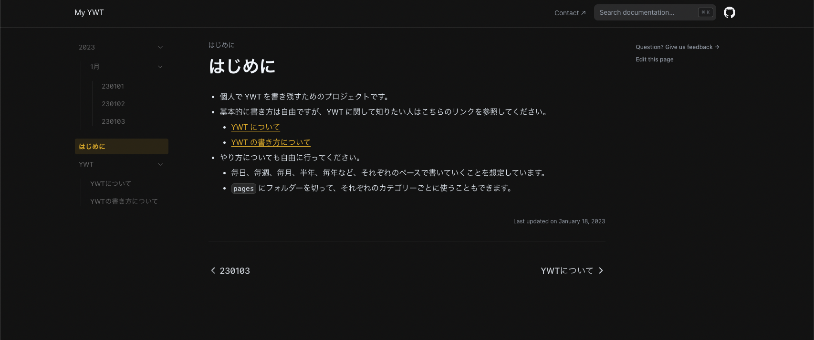

# nextra-ywt

## 参考リポジトリ

[shuding/nextra-docs-template: Nextra docs template](https://github.com/shuding/nextra-docs-template)

## Nextra リンク

### 基本的なガイド

- [ファイル管理](https://nextra.site/docs/guide/organize-files)
- [マークダウン](https://nextra.site/docs/guide/markdown)
- [シンタックスハイライト](https://nextra.site/docs/guide/syntax-highlighting)
- Next.js 機能
  - [SSG](https://nextra.site/docs/guide/ssg)
  - [i18n](https://nextra.site/docs/guide/i18n)
  - [Image](https://nextra.site/docs/guide/image)
  - [Link](https://nextra.site/docs/guide/link)
- [LaTeX](https://nextra.site/docs/guide/latex)
- [テーブル表示](https://nextra.site/docs/guide/advanced/table)

### Docs テーマ

- テーマ構成
  - [Theme Configuration – Nextra](https://nextra.site/docs/docs-theme/theme-configuration)
- ページ構成
  - [Page Configuration – Nextra](https://nextra.site/docs/docs-theme/page-configuration)
- ビルトイン機能
  - [Built-ins – Nextra](https://nextra.site/docs/docs-theme/built-ins)

### カスタムテーマ

- [カスタムテーマ](https://nextra.site/docs/custom-theme)

## 動作環境

|    名前    | バージョン |
| :--------: | :--------: |
|  Node.js   |  18.12.0   |
|    npm     |   8.19.2   |
|  next.js   |   13.1.2   |
|   react    |   18.2.0   |
| react-dom  |   18.2.0   |
|   nextra   |   2.2.4    |
| typescript |   4.9.4    |

## ローカル環境 Local Development

- `yarn install`
  - 依存性の解決
- `yarn dev`
  - 開発サーバーの立ち上げ
  - 基本的に `localhost:3000` になる

## 必要であれば、各自で修正すること

- `theme.config.tsx`
  - `project` 、 `docsRepositoryBase` 、 `head` を修正する
- `_meta.json`
  - `contact.href` に SNS のアカウント名を追加する
